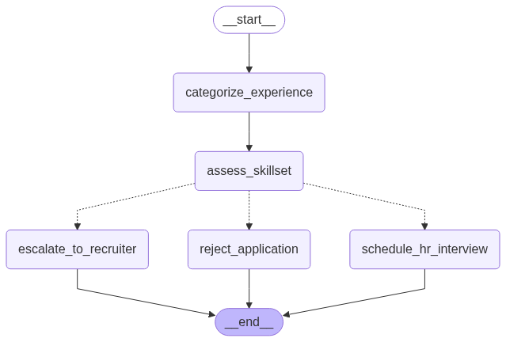

## 🤖 Recruiter Workflow Agent

An AI-powered recruitment assistant that automates the candidate screening workflow using LangGraph, LangChain, and Groq LLMs.

The agent evaluates job applications, matches skills, and routes candidates to the right stage:
✅ Schedule HR interview
⚠️ Escalate to recruiter
❌ Reject application

### ✨ Features

🧩 Graph-based Workflow – modular and interpretable flow using LangGraph

📊 Experience Categorization – classifies applications as Entry-level, Mid-level, Senior-level

🛠 Skill Matching – verifies candidate fit for a Python Developer role

⚡ Automated Routing – decides whether to shortlist, escalate, or reject

🎨 Graph Visualization – view the workflow in Mermaid or Graphviz

🔑 Groq-powered LLM – fast inference using Groq API

